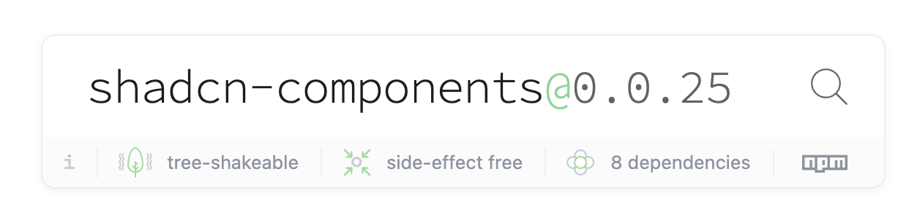

### Tree shakable
🌳 Library is tree shakeable, so what is not imported will not be in final bundle of the app 🎉!


### Installation
* ⚠️ tailwind is requirement so install it first https://tailwindcss.com/docs/guides/vite
* install package
  ```npm install shadcn-components```
* add tailwind configuration for components to **tailwind.config.ts**:
```ts
import { shadcnPreset } from "shadcn-components"

/** @type {import('tailwindcss').Config} */
export default {
  presets: [
    shadcnPreset
  ],
	content: [
    "./src/**/*.{ts,tsx}",
    "./node_modules/shadcn-components/**/*.{js,jsx,ts,tsx}"
  ],
}

```
> Theme can be overwritten here and additional tailwind properties may be added. Check `./node_modules/shadcn-components/dist/tailwind.config.js` for base!

### Configure theme
Use theme generator for shadcn such as https://ui.shadcn.com/themes or https://zippystarter.com/tools/shadcn-ui-theme-generator.
Copy generated theme to index.css in your project. Make sure css file is imported in the app! <br />
e.g. 
```css
@tailwind base;
@tailwind components;
@tailwind utilities;

:root  {
  --background: 199 18% 95%;
  --foreground: 199 5% 10%;
  --card: 199 18% 93%;
  --card-foreground: 199 5% 15%;
  --popover: 199 18% 95%;
  --popover-foreground: 199 95% 10%;
  --primary: 199 100% 55%;
  --primary-foreground: 0 0% 100%;
  --secondary: 199 18% 90%;
  --secondary-foreground: 0 0% 0%;
  --muted: 161 18% 93%;
  --muted-foreground: 199 5% 40%;
  --accent: 161 18% 90%;
  --accent-foreground: 199 5% 15%;
  --destructive: 0 50% 50%;
  --destructive-foreground: 199 5% 93%;
  --border: 199 20% 82%;
  --input: 199 20% 50%;
  --ring: 199 100% 55%;
  --radius: 1rem;
}
.dark  {
  --background: 199 18% 10%;
  --foreground: 199 5% 93%;
  --card: 199 18% 10%;
  --card-foreground: 199 5% 93%;
  --popover: 199 18% 5%;
  --popover-foreground: 199 5% 93%;
  --primary: 199 100% 55%;
  --primary-foreground: 0 0% 100%;
  --secondary: 199 18% 20%;
  --secondary-foreground: 0 0% 100%;
  --muted: 161 18% 25%;
  --muted-foreground: 199 5% 65%;
  --accent: 161 18% 25%;
  --accent-foreground: 199 5% 93%;
  --destructive: 0 50% 50%;
  --destructive-foreground: 199 5% 93%;
  --border: 199 20% 50%;
  --input: 199 20% 50%;
  --ring: 199 100% 55%;
  --radius: 1rem;
}
}
```

Theme can also be added to the global tailwind config using plugins.
First convert generated theme to js code and add it to custom plugin.

* create custom plugin
  ```ts
  import plugin from "tailwindcss/plugin";

  export const customPlugin = plugin(
    // 1. Add css variable definitions to the base layer
    ({ addBase }) => {
      addBase({
        ":root": {
          "--background": "199 18% 95%",
          "--foreground": "199 5% 10%",
          "--card": "199 18% 93%",
          "--card-foreground": "199 5% 15%",
          "--popover": "199 18% 95%",
          "--popover-foreground": "199 95% 10%",
          "--primary": "199 100% 55%",
          "--primary-foreground": "0 0% 100%",
          "--secondary": "199 18% 90%",
          "--secondary-foreground": "0 0% 0%",
          "--muted": "161 18% 93%",
          "--muted-foreground": "199 5% 40%",
          "--accent": "161 18% 90%",
          "--accent-foreground": "199 5% 15%",
          "--destructive": "0 50% 50%",
          "--destructive-foreground": "199 5% 93%",
          "--border": "199 20% 82%",
          "--input": "199 20% 50%",
          "--ring": "199 100% 55%",
          "--radius": "1rem"
        },
        ".dark": {
          "--background": "199 18% 10%",
          "--foreground": "199 5% 93%",
          "--card": "199 18% 10%",
          "--card-foreground": "199 5% 93%",
          "--popover": "199 18% 5%",
          "--popover-foreground": "199 5% 93%",
          "--primary": "199 100% 55%",
          "--primary-foreground": "0 0% 100%",
          "--secondary": "199 18% 20%",
          "--secondary-foreground": "0 0% 100%",
          "--muted": "161 18% 25%",
          "--muted-foreground": "199 5% 65%",
          "--accent": "161 18% 25%",
          "--accent-foreground": "199 5% 93%",
          "--destructive": "0 50% 50%",
          "--destructive-foreground": "199 5% 93%",
          "--border": "199 20% 50%",
          "--input": "199 20% 50%",
          "--ring": "199 100% 55%",
          "--radius": "1rem"
        }
      });
    }
  );
  ```

* import plugin to tailwind config

  ```ts
  import { shadcnPreset } from "shadcn-components"
  import { customPlugin } from "./custom-plugin"

  /** @type {import('tailwindcss').Config} */
  export default {
    presets: [
      shadcnPreset
    ],
    plugins: [customPlugin],
    content: [
      "./src/**/*.{ts,tsx}",
      "./node_modules/shadcn-components/**/*.{js,jsx,ts,tsx}"
    ],
  }
  ```

### Usage
```tsx
import {
  Badge,
  Button,
  Calendar
} from 'shadcn-components'
```
